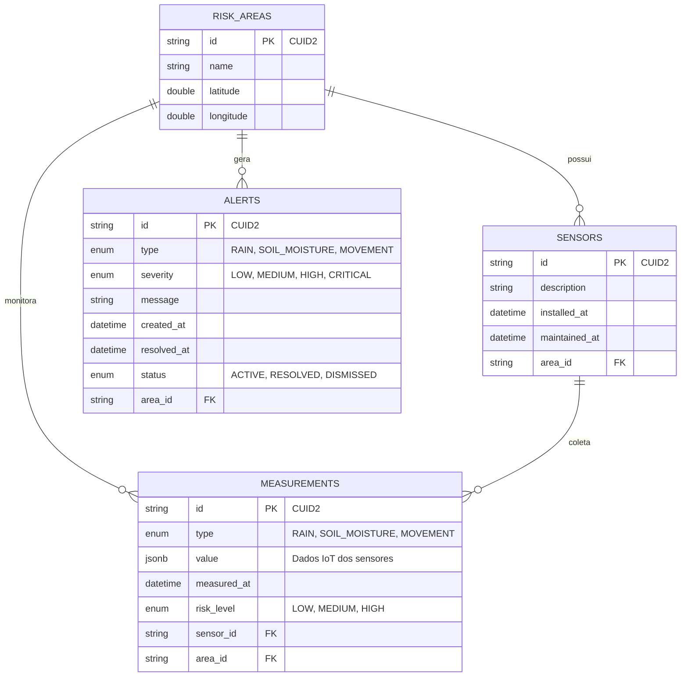
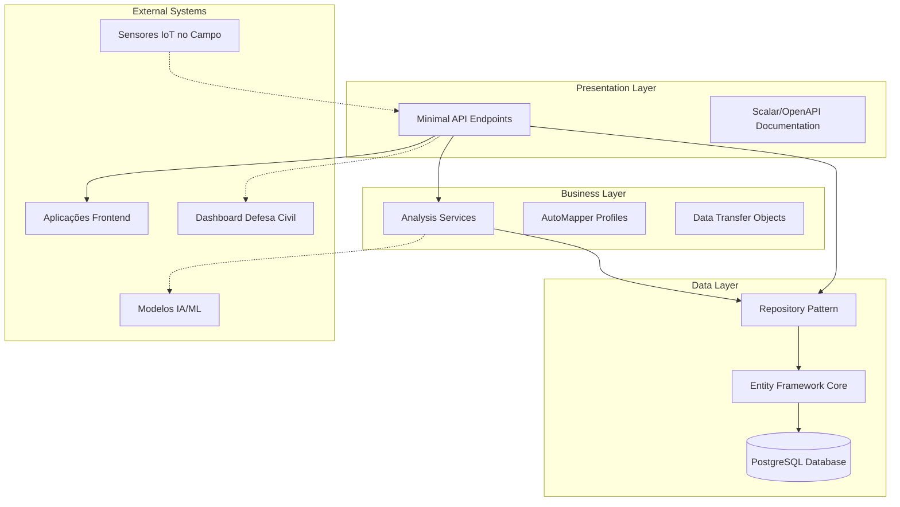

# SIMAPD API

## 🚀 Sobre o Projeto

A **SIMAPD API** (Sistema Integrado de Monitoramento e Alerta para Prevenção de Desastres) é uma API RESTful desenvolvida em ASP.NET Core .NET 9.0 para monitoramento ambiental em tempo real e prevenção de desastres naturais. A API fornece endpoints completos para gerenciamento de áreas de risco, sensores, medições ambientais e alertas de emergência, com integração ao banco de dados PostgreSQL e documentação automática via OpenAPI/Scalar.

## 👥 Equipe de Desenvolvimento

| Nome | RM | E-mail | GitHub | LinkedIn |
|------|-------|---------|---------|----------|
| Arthur Vieira Mariano | RM554742 | arthvm@proton.me | [@arthvm](https://github.com/arthvm) | [arthvm](https://linkedin.com/in/arthvm/) |
| Guilherme Henrique Maggiorini | RM554745 | guimaggiorini@gmail.com | [@guimaggiorini](https://github.com/guimaggiorini) | [guimaggiorini](https://linkedin.com/in/guimaggiorini/) |
| Ian Rossato Braga | RM554989 | ian007953@gmail.com | [@iannrb](https://github.com/iannrb) | [ianrossato](https://linkedin.com/in/ianrossato/) |

## 🛠️ Tecnologias Utilizadas

### Stack Principal
- **.NET 9.0** - Framework principal
- **ASP.NET Core** - Minimal API
- **Entity Framework Core 9.0.5** - ORM
- **PostgreSQL** - Banco de dados principal
- **AutoMapper 14.0.0** - Mapeamento de objetos
- **Scalar 2.4.4** - Documentação da API
- **CUID.NET 6.0.1** - Geração de IDs únicos

### Arquitetura
- **Minimal API** - Implementação de rotas
- **Repository Pattern** - Abstração de acesso a dados
- **DTOs** - Transferência de dados
- **Migrations** - Controle de versão do banco
- **Services Pattern** - Lógica de negócio

## 🌍 Problema e Solução

### Cenário Crítico Nacional
O Brasil enfrenta uma das maiores vulnerabilidades socioambientais: **desastres naturais causados por deslizamentos e inundações**. Os números revelam a dimensão dessa tragédia:

- 📈 **4.146 mortes** por deslizamentos entre 1988 e 2022
- 🏘️ **3,9 milhões de pessoas** vivem em áreas de risco
- 📍 **13.297 áreas de risco** oficialmente mapeadas
- 💰 **R$ 502 bilhões** em prejuízos econômicos acumulados

### Nossa Solução Inovadora
O **SIMAPD** (Sistema Integrado de Monitoramento e Alerta para Prevenção de Desastres) representa uma **transformação do modelo reativo para proativo** na gestão de riscos naturais:

#### 🎯 **Abordagem Preventiva**
- **Monitoramento contínuo** via sensores IoT em tempo real
- **Detecção precoce** de indicadores críticos de risco
- **Inteligência Artificial** para predição de eventos extremos
- **Alertas automáticos** para evacuação preventiva

#### 🔬 **Tecnologia Implementada**
- **API REST robusta** para coleta de dados de sensores
- **Banco de dados otimizado** para armazenamento de telemetria
- **Sistema de alertas** baseado em thresholds configuráveis
- **Documentação interativa** via Swagger/Scalar
- **Arquitetura escalável** preparada para integração

#### 🎯 **Objetivos de Integração**
- **Sensores IoT físicos** para movimentação, umidade e chuva
- **Aplicações frontend** (mobile, web) via API
- **Dashboard web** para Defesa Civil
- **Algoritmos de IA** para análise preditiva

#### 💪 **Impacto Transformador**
- **Salvar vidas** através de evacuação preventiva
- **Reduzir prejuízos** econômicos e sociais
- **Proteger comunidades** vulneráveis
- **Antecipação** de situações de risco iminente

## 🗄️ Estrutura do Banco de Dados

### Diagrama de Entidades



### Relacionamentos Implementados
- **RiskArea → Sensor** (1:N): Uma área de risco pode ter múltiplos sensores
- **RiskArea → Measurement** (1:N): Uma área de risco pode ter múltiplas medições
- **RiskArea → Alert** (1:N): Uma área de risco pode gerar múltiplos alertas
- **Sensor → Measurement** (1:N): Um sensor pode coletar múltiplas medições

## 🏗️ Arquitetura da Aplicação



## 🚀 Como Executar o Projeto

### Pré-requisitos

- **.NET 9.0 SDK**
- **.NET Entity Framework CLI**
- **PostgreSQL Database**
- **Git**

### 💻 Execução Local (Desenvolvimento)

1. **Clone o repositório:**
   ```bash
   git clone https://github.com/simapd/aspnet
   cd aspnet
   ```

2. **Configure o PostgreSQL:**
   ```bash
   # Certifique-se de que o PostgreSQL está rodando
   # Crie o banco de dados:
   createdb simapd
   
   # Ou via psql:
   psql -U postgres -c "CREATE DATABASE simapd;"
   ```

3. **Configure a variável de ambiente:**
   ```bash
   # Opção 1: Variável de ambiente do sistema
   export DB_CONNECTION_STRING="Host=localhost;Database=simapd;Username=postgres;Password=sua_senha;TrustServerCertificate=true;"
   
   # Opção 2: Arquivo .env na raiz do projeto (criar manualmente)
   echo 'DB_CONNECTION_STRING="Host=localhost;Database=simapd;Username=postgres;Password=sua_senha;TrustServerCertificate=true;"' > .env
   ```

4. **Instale o Entity Framework CLI (se não tiver):**
   ```bash
   dotnet tool install --global dotnet-ef
   ```

5. **Restaure as dependências:**
   ```bash
   dotnet restore
   ```

6. **Execute as migrations:**
   ```bash
   dotnet ef database update
   ```

7. **Execute a API:**
   ```bash
   dotnet run
   ```

8. **Acesse a aplicação:**
   - **API Base**: `http://localhost:5215`
   - **Scalar UI**: `http://localhost:5215/scalar/v1`
   - **OpenAPI JSON**: `http://localhost:5215/openapi/v1.json`
   - **Health Check**: `http://localhost:5215/health`

### Usando Docker

#### Opção 1: Docker Run (Recomendado)

```bash
# 1. Build da imagem
docker build -t simapd-api .

# 2. Execute o container passando a connection string
docker run -p 8080:8080 \
  -e DB_CONNECTION_STRING="Host=seu-host;Database=simapd;Username=seu-usuario;Password=sua-senha;TrustServerCertificate=true;" \
  simapd-api
```

#### Opção 2: Docker Compose

```bash
# Build e execute com Docker Compose
docker-compose up --build
```

## 📋 Rotas da API

### Health Check
| Método | Endpoint | Descrição | Retorno |
|--------|----------|-----------|---------|
| GET | `/health` | Verificação de saúde da API | 200 OK |

### 🏞️ Risk Areas (Áreas de Risco)
| Método | Endpoint | Descrição | Parâmetros | Retorno |
|--------|----------|-----------|------------|---------|
| GET | `/risk-areas` | Lista áreas de risco com paginação | `pageNumber`, `pageSize` | 200 OK, 400 BadRequest |
| GET | `/risk-areas/{id}` | Busca área de risco por ID | `id` (path) | 200 OK, 404 NotFound, 400 BadRequest |
| POST | `/risk-areas` | Cria nova área de risco | Body: `RiskAreaRequestDto` | 201 Created, 400 BadRequest |
| PUT | `/risk-areas/{id}` | Atualiza área de risco existente | `id` (path), Body: `RiskAreaRequestDto` | 200 OK, 404 NotFound, 400 BadRequest |
| DELETE | `/risk-areas/{id}` | Remove área de risco | `id` (path) | 204 NoContent, 404 NotFound, 400 BadRequest |

### 📡 Sensors (Sensores)
| Método | Endpoint | Descrição | Parâmetros | Retorno |
|--------|----------|-----------|------------|---------|
| GET | `/risk-areas/{areaId}/sensors` | Lista sensores com paginação | `areaId` (path), `pageNumber`, `pageSize` | 200 OK, 400 BadRequest, 404 NotFound |
| GET | `/risk-areas/{areaId}/sensors/{id}` | Busca sensor por ID | `areaId`, `id` (path) | 200 OK, 404 NotFound, 400 BadRequest |
| POST | `/risk-areas/{areaId}/sensors` | Registra novo sensor | `areaId` (path), Body: `SensorRequestDto` | 201 Created, 400 BadRequest, 404 NotFound |
| PUT | `/risk-areas/{areaId}/sensors/{id}` | Atualiza sensor existente | `areaId`, `id` (path), Body: `SensorRequestDto` | 200 OK, 404 NotFound, 400 BadRequest |
| DELETE | `/risk-areas/{areaId}/sensors/{id}` | Remove sensor | `areaId`, `id` (path) | 204 NoContent, 404 NotFound, 400 BadRequest |

### 📊 Measurements (Medições)
| Método | Endpoint | Descrição | Parâmetros | Retorno |
|--------|----------|-----------|------------|---------|
| GET | `/measurements` | Lista medições com paginação | `pageNumber`, `pageSize`, `areaId`, `sensorId` | 200 OK, 400 BadRequest |
| GET | `/measurements/{id}` | Busca medição por ID | `id` (path) | 200 OK, 404 NotFound, 400 BadRequest |
| POST | `/measurements` | Registra nova medição | Body: `MeasurementRequestDto` | 201 Created, 400 BadRequest |

### 🚨 Alerts (Alertas)
| Método | Endpoint | Descrição | Parâmetros | Retorno |
|--------|----------|-----------|------------|---------|
| GET | `/risk-areas/{areaId}/alerts` | Lista alertas com paginação | `areaId` (path), `pageNumber`, `pageSize` | 200 OK, 400 BadRequest, 404 NotFound |
| GET | `/risk-areas/{areaId}/alerts/{id}` | Busca alerta por ID | `areaId`, `id` (path) | 200 OK, 404 NotFound, 400 BadRequest |
| POST | `/risk-areas/{areaId}/alerts` | Cria novo alerta | `areaId` (path), Body: `AlertRequestDto` | 201 Created, 400 BadRequest, 404 NotFound |
| PUT | `/risk-areas/{areaId}/alerts/{id}` | Atualiza status do alerta | `areaId`, `id` (path), Body: `AlertRequestDto` | 200 OK, 404 NotFound, 400 BadRequest |
| DELETE | `/risk-areas/{areaId}/alerts/{id}` | Remove alerta | `areaId`, `id` (path) | 204 NoContent, 404 NotFound, 400 BadRequest |

## 🎯 Funcionalidades Implementadas

### ✅ API REST Completa
- **Risk Areas**: Gestão completa de áreas de risco geográficas
- **Sensors**: Cadastro e manutenção de sensores ambientais
- **Measurements**: Coleta e consulta de dados ambientais
- **Alerts**: Sistema de alertas para situações críticas

### ✅ Análise de Dados Implementada
- **Risk Analysis Service**: Análise básica de padrões de risco
- **Threshold Detection**: Detecção de valores críticos configuráveis
- **Automated Alerting**: Geração automática de alertas baseada em regras

### 🎯 Análise Avançada (Desenvolvimento Futuro)
- **Machine Learning**: Algoritmos para predição de eventos extremos
- **Pattern Recognition**: Identificação de padrões pré-desastre
- **AI Prediction**: Modelos treinados com dados históricos

### ✅ Rotas Parametrizadas
- **Query Parameters**: Paginação, filtros por área e sensor
- **Path Parameters**: IDs únicos CUID2
- **Request Bodies**: DTOs validados

### ✅ Retornos HTTP Adequados
- **200 OK**: Sucesso em consultas e atualizações
- **201 Created**: Criação de novos recursos
- **204 NoContent**: Exclusão bem-sucedida
- **400 BadRequest**: Dados inválidos ou parâmetros incorretos
- **404 NotFound**: Recurso não encontrado
- **500 InternalServerError**: Erro interno do servidor

### ✅ Integração com PostgreSQL
- Entity Framework Core com provider PostgreSQL
- Migrations para criação e versionamento das tabelas
- Suporte a dados JSONB para estruturas flexíveis
- Connection string via variável de ambiente
- Preparado para escalabilidade futura

### ✅ Documentação OpenAPI
- Scalar UI para interface gráfica moderna
- Documentação detalhada de todas as rotas
- Schemas de request/response bem definidos
- Exemplos práticos de uso

## 📊 Exemplos de Uso

### 🏞️ Gerenciamento de Áreas de Risco

```bash
# Listar áreas de risco
curl -X GET "http://localhost:5215/risk-areas?pageNumber=1&pageSize=10"

# Criar nova área de risco
curl -X POST "http://localhost:5215/risk-areas" \
  -H "Content-Type: application/json" \
  -d '{
    "name": "Nova Friburgo - Região Serrana RJ",
    "latitude": -22.2816,
    "longitude": -42.5311
  }'

# Buscar área específica
curl -X GET "http://localhost:5215/risk-areas/k7u1v2w3x4y5z6a7b8c9d0"
```

### 📡 Gerenciamento de Sensores IoT

```bash
# Listar sensores de uma área de risco
curl -X GET "http://localhost:5215/risk-areas/k7u1v2w3x4y5z6a7b8c9d0/sensors?pageNumber=1&pageSize=10"

# Registrar novo sensor IoT de movimentação
curl -X POST "http://localhost:5215/risk-areas/k7u1v2w3x4y5z6a7b8c9d0/sensors" \
  -H "Content-Type: application/json" \
  -d '{
    "description": "Sensor IoT Movimentação Terreno - Morro da Formiga/RJ",
    "installedAt": "2024-01-15T10:00:00Z"
  }'

# Buscar sensor específico
curl -X GET "http://localhost:5215/risk-areas/k7u1v2w3x4y5z6a7b8c9d0/sensors/s1e2n3s4o5r6a7b8c9d0e1"
```

### 📊 Coleta de Telemetria IoT

```bash
# Registrar medição crítica de chuva
curl -X POST "http://localhost:5215/measurements" \
  -H "Content-Type: application/json" \
  -d '{
    "type": "RAIN",
    "value": {
      "rainLevel": 850
    },
    "riskLevel": "HIGH",
    "sensorId": "s1e2n3s4o5r6a7b8c9d0e1",
    "areaId": "k7u1v2w3x4y5z6a7b8c9d0",
    "measuredAt": "2024-01-15T15:30:00Z"
  }'

# Registrar medição de movimentação do solo
curl -X POST "http://localhost:5215/measurements" \
  -H "Content-Type: application/json" \
  -d '{
    "type": "MOVEMENT",
    "value": {
      "acceleration": {
        "magnitude": 0.75
      },
      "rotation": {
        "magnitude": 0.45
      }
    },
    "riskLevel": "MEDIUM",
    "sensorId": "s2o3i4l5m6o7i8s9t0u1r2",
    "areaId": "k7u1v2w3x4y5z6a7b8c9d0"
  }'

# Listar medições com filtros
curl -X GET "http://localhost:5215/measurements?pageNumber=1&pageSize=10&areaId=k7u1v2w3x4y5z6a7b8c9d0"
```

### 🚨 Sistema de Alertas

```bash
# Listar alertas de uma área de risco
curl -X GET "http://localhost:5215/risk-areas/k7u1v2w3x4y5z6a7b8c9d0/alerts?pageNumber=1&pageSize=10"

# Criar alerta de emergência
curl -X POST "http://localhost:5215/risk-areas/k7u1v2w3x4y5z6a7b8c9d0/alerts" \
  -H "Content-Type: application/json" \
  -d '{
    "message": "Nível crítico de chuva detectado na região",
    "level": "HIGH",
    "origin": "MANUAL"
  }'

# Buscar alerta específico
curl -X GET "http://localhost:5215/risk-areas/k7u1v2w3x4y5z6a7b8c9d0/alerts/a1l2e3r4t5a6b7c8d9e0f1"
```


## 🧪 Testes da API

### Cenários de Teste Implementados

#### ✅ Testes de Risk Areas
- **Criação válida**: Área com coordenadas dentro dos limites geográficos
- **Validação de dados**: Nome obrigatório, latitude (-90 a 90), longitude (-180 a 180)
- **Busca por ID**: CUID2 válido vs inválido
- **Paginação**: Diferentes tamanhos de página e números

#### ✅ Testes de Measurements
- **Tipos suportados**: RAIN, SOIL_MOISTURE, MOVEMENT
- **Análise de risco**: Classificação básica (LOW, MEDIUM, HIGH)
- **Filtros**: Por área, por sensor, por período
- **Integridade**: Validação de sensor e área de risco existentes

#### 🎯 Funcionalidades Futuras
- **Detecção de padrões**: Algoritmos pré-deslizamento e pré-enchente
- **Análise avançada**: Correlação entre múltiplos sensores
- **Machine Learning**: Predição baseada em histórico

#### ✅ Testes de Alerts
- **Geração básica**: Baseada em thresholds simples
- **Severidade**: LOW, MEDIUM, HIGH, CRITICAL
- **Status**: ACTIVE, RESOLVED, DISMISSED
- **API endpoints**: CRUD completo para alertas

#### 🎯 Notificações Futuras
- **Push notifications**: Mobile e web
- **Integração externa**: Callbacks para Defesa Civil
- **SMS/Email**: Alertas automáticos à população

### Testes Manuais Sugeridos

```bash
# 1. Testar Health Check
curl -X GET "http://localhost:5215/health"

# 2. Testar criação de área de risco
curl -X POST "http://localhost:5215/risk-areas" \
  -H "Content-Type: application/json" \
  -d '{
    "name": "Área de Teste - Santos/SP",
    "latitude": -23.9608,
    "longitude": -46.3331
  }'

# 3. Testar listagem com paginação
curl -X GET "http://localhost:5215/risk-areas?pageNumber=1&pageSize=5"

# 4. Testar validação de dados (deve retornar erro 400)
curl -X POST "http://localhost:5215/risk-areas" \
  -H "Content-Type: application/json" \
  -d '{
    "name": "",
    "latitude": 91,
    "longitude": -181
  }'
```

### Cenários de Teste Completos

#### 🧪 **Cenário 1: Fluxo Completo de Monitoramento**
```bash
# 1. Criar área de risco
AREA_ID=$(curl -s -X POST "http://localhost:5215/risk-areas" \
  -H "Content-Type: application/json" \
  -d '{
    "name": "Nova Friburgo - Teste",
    "latitude": -22.2816,
    "longitude": -42.5311
  }' | jq -r '.id')

# 2. Adicionar sensor à área
SENSOR_ID=$(curl -s -X POST "http://localhost:5215/risk-areas/$AREA_ID/sensors" \
  -H "Content-Type: application/json" \
  -d '{
    "description": "Sensor de Teste - Chuva"
  }' | jq -r '.id')

# 3. Registrar medição crítica
curl -X POST "http://localhost:5215/measurements" \
  -H "Content-Type: application/json" \
  -d '{
    "type": "RAIN",
    "value": {"rainLevel": 950},
    "riskLevel": "HIGH",
    "sensorId": "'$SENSOR_ID'",
    "areaId": "'$AREA_ID'"
  }'

# 4. Criar alerta baseado na medição crítica
curl -X POST "http://localhost:5215/risk-areas/$AREA_ID/alerts" \
  -H "Content-Type: application/json" \
  -d '{
    "message": "ALERTA CRÍTICO: Nível de chuva extremo detectado (950mm/h). Risco iminente de enchente.",
    "level": "HIGH",
    "origin": "SENSOR_AUTOMATED"
  }'

# 5. Verificar alertas da área
curl -X GET "http://localhost:5215/risk-areas/$AREA_ID/alerts"

# 6. Verificar medições registradas
curl -X GET "http://localhost:5215/measurements?areaId=$AREA_ID"
```

#### 🧪 **Cenário 2: Testes de Validação**
```bash
# Teste 1: ID inválido (deve retornar 400)
curl -X GET "http://localhost:5215/risk-areas/id-invalido"

# Teste 2: Coordenadas inválidas (deve retornar 400)
curl -X POST "http://localhost:5215/risk-areas" \
  -H "Content-Type: application/json" \
  -d '{
    "name": "Teste Inválido",
    "latitude": 100,
    "longitude": -200
  }'

# Teste 3: Área inexistente para sensor (deve retornar 404)
curl -X POST "http://localhost:5215/risk-areas/abcdefghijklmnopqrstuvwxyz/sensors" \
  -H "Content-Type: application/json" \
  -d '{"description": "Sensor Teste"}'
```

#### 🧪 **Cenário 3: Teste de Performance e Paginação**
```bash
# Criar múltiplas áreas para teste de paginação
for i in {1..15}; do
  curl -X POST "http://localhost:5215/risk-areas" \
    -H "Content-Type: application/json" \
    -d '{
      "name": "Área de Teste '$i'",
      "latitude": -23.'$i',
      "longitude": -46.'$i'
    }'
done

# Testar paginação
curl -X GET "http://localhost:5215/risk-areas?pageNumber=1&pageSize=5"
curl -X GET "http://localhost:5215/risk-areas?pageNumber=2&pageSize=5"
curl -X GET "http://localhost:5215/risk-areas?pageNumber=3&pageSize=5"
```

#### 🧪 **Cenário 4: Análise de Dados de Sensores**
```bash
# Simular sequência de medições de diferentes tipos
curl -X POST "http://localhost:5215/measurements" \
  -H "Content-Type: application/json" \
  -d '{
    "type": "SOIL_MOISTURE",
    "value": {"moistureLevel": 85},
    "riskLevel": "MEDIUM",
    "sensorId": "'$SENSOR_ID'",
    "areaId": "'$AREA_ID'"
  }'

curl -X POST "http://localhost:5215/measurements" \
  -H "Content-Type: application/json" \
  -d '{
    "type": "MOVEMENT",
    "value": {
      "acceleration": {"magnitude": 1.2},
      "rotation": {"magnitude": 0.8}
    },
    "riskLevel": "HIGH",
    "sensorId": "'$SENSOR_ID'",
    "areaId": "'$AREA_ID'"
  }'

# Verificar medições filtradas por área
curl -X GET "http://localhost:5215/measurements?areaId=$AREA_ID&pageSize=10"
```

## 📈 Métricas e Monitoramento

### Health Check Detalhado
- **Endpoint**: `/health`
- **Response Time**: < 100ms
- **Database Connectivity**: Verificação automática
- **Memory Usage**: Monitoramento de recursos

### Logs Estruturados
- **Request/Response**: Logs detalhados de cada operação
- **Error Tracking**: Stack traces e contexto de erro
- **Performance**: Tempo de resposta por endpoint
- **Business Events**: Criação de alertas e detecção de riscos

## 🔧 Configuração e Deploy

### Variáveis de Ambiente

#### Para execução local (.NET)
```bash
# Database
DB_CONNECTION_STRING=Host=localhost;Database=simapd;Username=postgres;Password=password
```

#### Para execução com Docker
```bash
# A variável deve ser passada no docker run ou docker-compose
DB_CONNECTION_STRING=Host=seu-host;Database=simapd;Username=seu-usuario;Password=sua-senha;TrustServerCertificate=true;

# Exemplo de uso:
docker run -p 8080:8080 \
  -e DB_CONNECTION_STRING="Host=postgres-server;Database=simapd;Username=admin;Password=minhasenha123;TrustServerCertificate=true;" \
  simapd-api
```

## 🌟 Inovação e Impacto

### Aspectos Inovadores (Implementados)
- **API REST Robusta**: Sistema de monitoramento ambiental escalável
- **CUID2 IDs**: Identificadores únicos distribuídos para alta performance
- **JSONB Storage**: Armazenamento flexível para dados de sensores
- **Minimal API**: Arquitetura otimizada para baixa latência
- **Repository Pattern**: Abstração profissional de acesso a dados
- **Auto Documentation**: Swagger/Scalar integrado

### 🎯 Inovações Futuras
- **IoT Integration**: Sensores físicos com transmissão em tempo real
- **Machine Learning**: Algoritmos de predição baseados em histórico
- **Multi-sensor Fusion**: Correlação inteligente entre diferentes tipos de dados
- **Mobile/Web Apps**: Interfaces para população e autoridades

### 🎯 Integrações Futuras
- **📡 Sensores IoT**: Conexão com hardware físico no campo
- **🤖 IA Preditiva**: Algoritmos de machine learning integrados
- **🌐 Sistemas Externos**: Integração com Defesa Civil e órgãos públicos
- **📊 Analytics**: Dashboards avançados e relatórios

## 📝 Padrões de Desenvolvimento

- **Repository Pattern** para abstração de dados
- **DTOs** para transferência segura de dados
- **AutoMapper** para mapeamento automático
- **Minimal APIs** para performance otimizada
- **Environment Variables** para configurações sensíveis
- **SOLID Principles** na arquitetura
- **Clean Code** e documentação inline

## 📄 Licença

Este projeto foi desenvolvido para fins acadêmicos como parte do Global Solution da FIAP - Advanced Business Development with .NET.